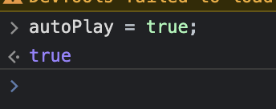

# Poker Pocket Backend

Nitramite Poker Pocket back end server was developed to run Texas Hold'em games. It's powering
[Nitramite Poker Pocket game](https://pokerpocket.nitramite.com/). This back end is pretty lightweight
and can run thousands of rooms easily.

### Background

Original reason I shared this code here was that I wanted to <b>find someone who wants to
create Virtual Reality front end</b> with Unity or any other game development platform.
Time has passed so much that I gave up and will no longer develop this further.
I also changed license to MIT allowing anyone build anything top of this,
but don't expect help from me since I have
moved to other things long time ago.
I may however sometimes check this repository out to update dependencies.

### Testing it out

Here's list of different front end clients. You may want to take a look at them to
see what it's all about.

* Sample Web UI: https://pokerpocket.nitramite.com/
  * Sample Web UI source code: https://github.com/norkator/Poker-Pocket-Web-Client
* Android client: https://play.google.com/store/apps/details?id=com.nitramite.pokerpocket
  * Android client source code: https://github.com/norkator/poker-pocket-android
* Web UI React version: https://github.com/linus2code/poker-pocket-react-client (created
  by [linus2code](https://github.com/linus2code))

### Prerequisites

* Download handRanks.dat file
  from: [https://github.com/christophschmalhofer/poker/blob/master/XPokerEval/XPokerEval.TwoPlusTwo/HandRanks.dat](https://github.com/christophschmalhofer/poker/blob/master/XPokerEval/XPokerEval.TwoPlusTwo/HandRanks.dat)  
  and place it under `/src/app` folder.
* Get database platform PostgreSQL https://www.postgresql.org/
  * You can also change database to something else, see:
    * https://github.com/norkator/poker-pocket-backend/blob/master/src/database/sequelize.js#L16
    * https://sequelize.org/docs/v6/other-topics/dialect-specific-things/

### Basic setup

1. config.js has some configurations you may want to change.
2. create `.env` file with following contents and provide database connection properties.

```dotenv
DB_DIALECT=postgres
DB_USER=database_user
DB_HOST=database_host
DB_DATABASE=PokerPocket
DB_PASSWORD=database_password
DB_PORT=5432
SERVER_CMD_PASSWORD=anypasswd
```

3. Run `npm install`
4. Run `npm run dev` on development environment (uses nodemon)
5. Backend is now running.
6. Open https://pokerpocket.nitramite.com/ and use connection switch set as `dev` to open connection
   to localhost web socket.

Optional: If you need created user to play automatically, go to browser console and type:



### Backend & front end communication

To create front end, it's essential to know how communication works.
Data transmission itself is build on top of web sockets and every message moves with specific `key` name.

I try explain steps in simple way:

1. New connection comes from front end.
2. Web socket is created and `connectionId` is generated which is basically integer with auto increment.
   Also webSocket library generates `socketKey` which is also returned and used for verification of requests from front
   end.
3. After step 2. front end asks rooms via `getRooms` or `getSpectateRooms` key which is then answered by same key name
   but result having array of rooms.
4. Front end renders rooms or spectating rooms and then click is handled by sending `selectRoom` or `selectSpectateRoom`
   key to back end.
5. User is then appended to selected room and back end will send room parameters with key `roomParams` to render view
   according to state of room.
6. All the other actions like calling, raising, folding, getting stats, login, creating account is only a
   matter of key and parameters needed to call that specific action. I fill more details later but everything is visible
   at
   code how to do it.

### Note

.gitignore is ignoring HandRanks.dat which is huge file

### Database

Before this project used MySQL NodeJS package but
it's now changed to Sequelize to support multiple database platforms.
See https://github.com/sequelize/sequelize for different connectors.
This back end come by default with  `pg` and `pg-hstore` for Postgres.

## Authors

* **Martin K.** - *Initial work* - [norkator](https://github.com/norkator)

## Contributors

### [shrpne](https://github.com/shrpne)

* [Commits](https://github.com/norkator/poker-pocket-backend/commits?author=shrpne)

### [linus2code](https://github.com/linus2code)

* [Commits](https://github.com/norkator/poker-pocket-backend/commits?author=linus2code)
* Created [React version](https://github.com/linus2code/poker-pocket-react-client) of Web UI

## License

MIT
